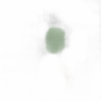
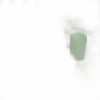
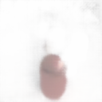
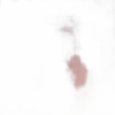
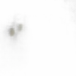
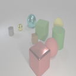
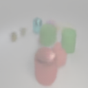

# Slot_Attention_Pytorch
pytorchでのslot_Attention[1]の実装。

＊コードのバグあり修正中。

## 現段階の例

slot: それぞれのslot内（slot数: 7）で検知された物体。epochが少ない（300）からか、まだ微妙。

       

正解画像：

各slotより再現された画像： 

引用論文
[1]Locatello, Francesco, et al. "Object-centric learning with slot attention." Advances in Neural Information Processing Systems 33 (2020): 11525-11538.

参考コード
https://github.com/google-research/google-research/tree/master/slot_attention
